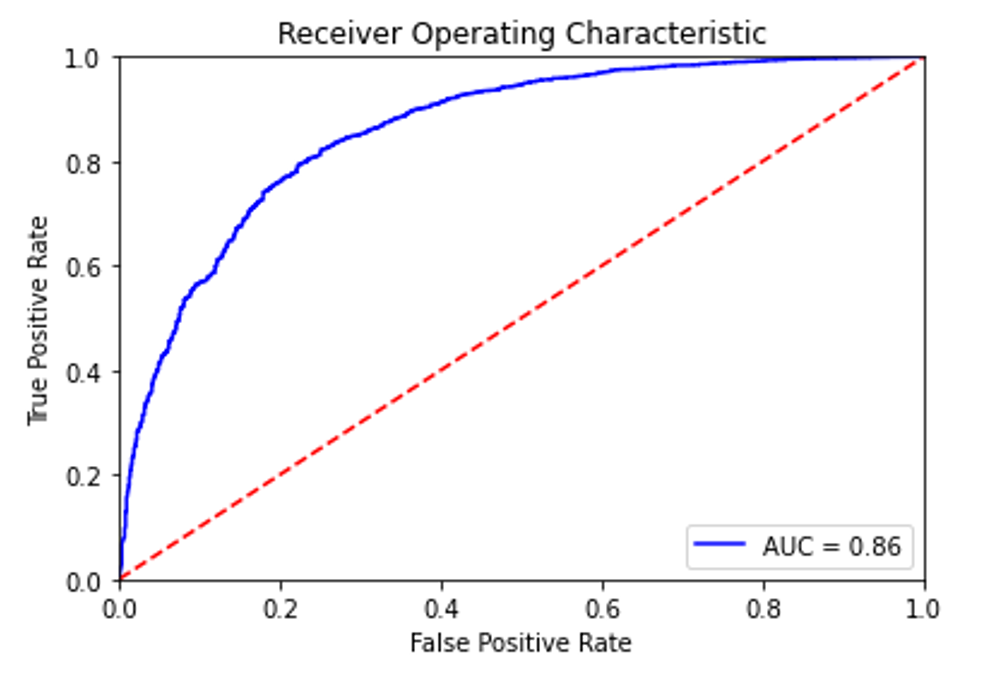

# offensive arabic
an Arabic offensive speach detector by fine tuning on pre-trained AraBERT

# Setup and Requirements
**1. CUDA:**
<br/>
install [CUDA](https://developer.nvidia.com/cuda-downloads) before installing the required packages or check if it is already installed 
<br/>
<br/>
**2. Clone the Translate repo:**
```
https://github.com/Strifee/offensive_Arabic.git
```
**3. install requirements:**
```
pip install -r requirements.txt
```
`if you have problem with CUDA package try this:`
```
conda install -q pytorch torchvision cudatoolkit=11 -c pytorch-nightly
```
**2. Training**
```
$ python train.py
```
**4. Testing**
```
$ python test.py
```

# Fine Tuning
```python
batch_size = 32
lr = 0.0001
epochs = 4
```

# Results
<br/>
AUC: 0.8596
Accuracy: 83.45%
<br/>

